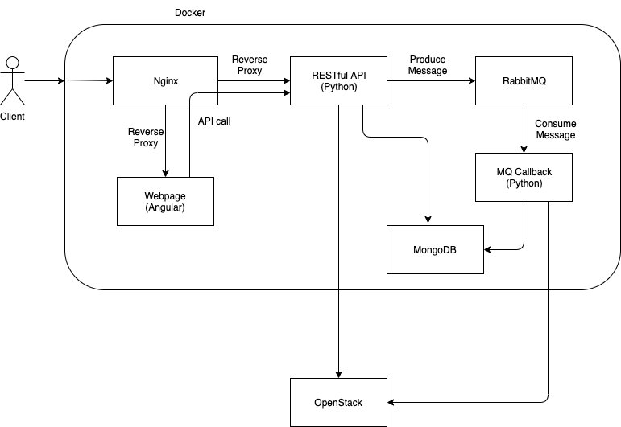
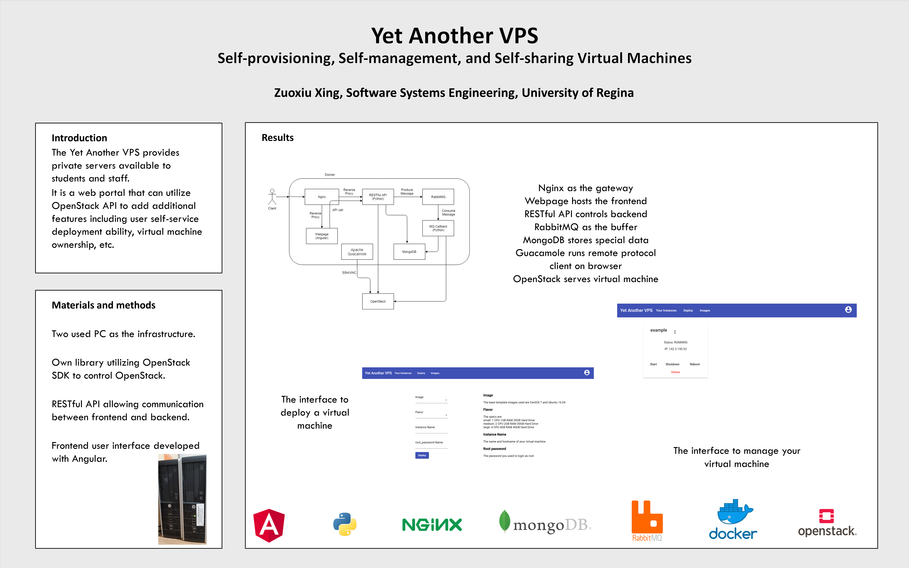
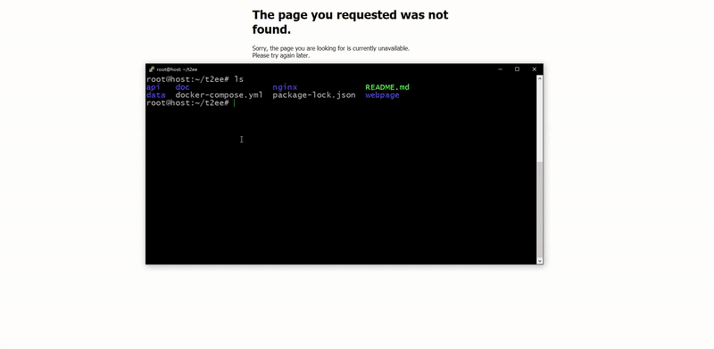

# Yet Another VPS

Yet Another VPS is a web portal - a layer above OpenStack - that can utilize OpenStack API to add additional features including user self-service deployment ability, virtual machine ownership, etc.

- [Yet Another VPS](#yet-another-vps)
  - [System Design](#system-design)
  - [Poster](#poster)
  - [Usage](#usage)
    - [Setup](#setup)
    - [Running Demo (For Faculty)](#running-demo-for-faculty)
  - [Documents](#documents)
  - [Links](#links)
    - [Trello Board](#trello-board)
    - [Presentation Video](#presentation-video)
    - [Quick Demo Video](#quick-demo-video)

## System Design



## Poster



## Usage

### Setup

Clone the repo, configure all config files respectively, and....

```bash
docker-compose up
```



### Running Demo (For Faculty)

On-campus access to the project: [Here](http://142.3.190.142/)

Off-campus access to the project: [Here](http://docker.hzyone.com:6001/)

However, to access the virtual machines, you need to use the university [VPN](https://vpn.uregina.ca/) to jump back to the campus network.

## Documents

Documents [Here](doc)

## Links

### Trello Board

[Trello](https://trello.com/b/FHkfT7ZH/t2ee)

### Presentation Video

[](https://youtu.be/U3sPZsQAEJo)

### Quick Demo Video

[](http://www.youtube.com/watch?v=AP4eokqmSOM)
