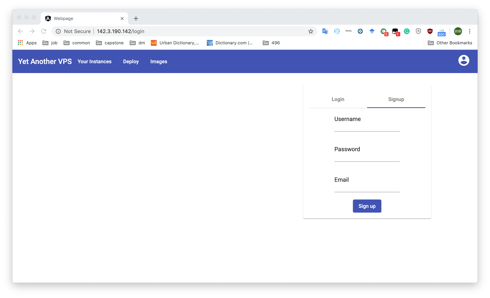
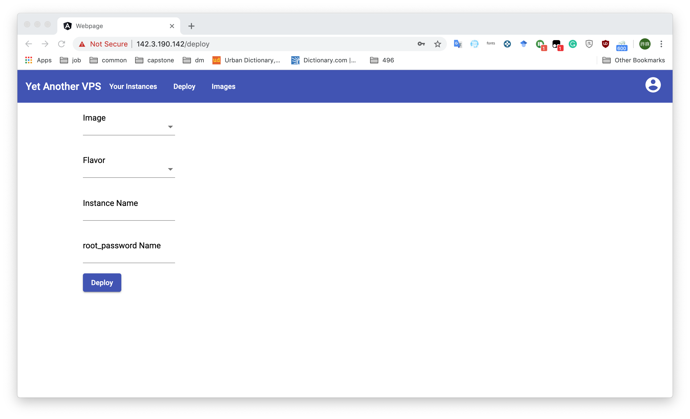
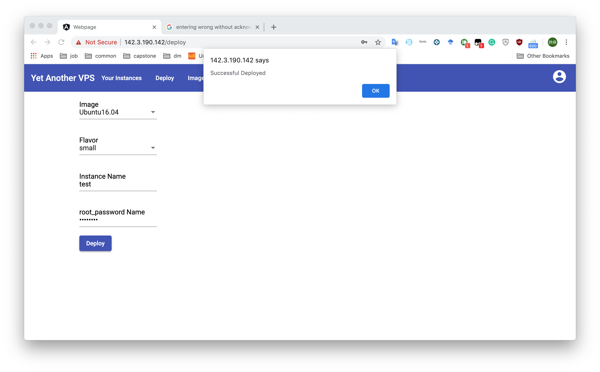
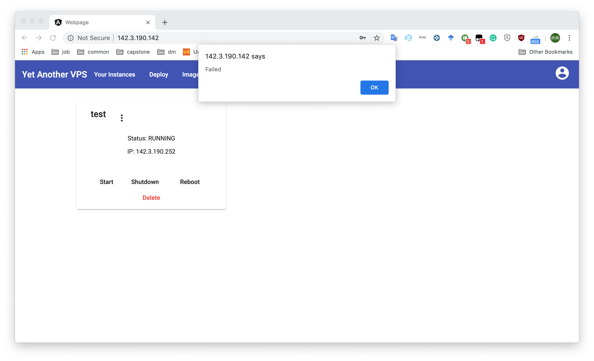

# After Action Review Report

This document talks about the overall project experience.

**Table of Contents:**

- [After Action Review Report](#after-action-review-report)
  - [What was Expected to Happen](#what-was-expected-to-happen)
    - [Purpose](#purpose)
    - [Objective](#objective)
    - [Timeline](#timeline)
    - [People Involved](#people-involved)
    - [Intented Outcomes](#intented-outcomes)
    - [Expected Barriers](#expected-barriers)
  - [What Actually Occurred](#what-actually-occurred)
    - [Real Timeline](#real-timeline)
    - [The Good Part](#the-good-part)
      - [Testing](#testing)
    - [The Bad Part](#the-bad-part)
      - [Password Validation](#password-validation)
      - [User Alert](#user-alert)
      - [Testing](#testing-1)
  - [What Went Well and Why](#what-went-well-and-why)
    - [Successful Step](#successful-step)
    - [Learning OpenStack](#learning-openstack)
    - [Front-end](#front-end)
  - [What Can be Improved and Why](#what-can-be-improved-and-why)
  - [What Did I learn](#what-did-i-learn)
    - [Software Development Cycle](#software-development-cycle)
    - [Compromises](#compromises)
    - [Technologies](#technologies)

## What was Expected to Happen

### Purpose

The purpose of this project is to provides private servers available to students and staff so that students can learn more about Linux and utilize the potential of Linux servers with their project, and professors can create templates to have a different approach to teaching.

### Objective

The object of this project is to create a platform which is self-service web portal that students can go on there and deploy virtual machine by themselves.

### Timeline

The initial timeline was:

1. Setup the physical servers (two used PC) and move them on campus by the end of Fall 2019 semester.
2. Finish backend services by the end of Christmas break.
3. Finish the coding part of the project by the end of winter break.

### People Involved

Since this is a team-of-one project, there was only one person involved in the software development. And with the help of the mentor - Dr. El-Darieby, I am able to serve my project in his lab room and the help of Mark Haidl from University IT department, I am able to get static IP addresses on campus for the two physical servers.

### Intented Outcomes

The original plan of the project was to use KVM (Kernel-based Virtual Machine) to host virtual machines and write own KVM managing services by Python and this plan was abandoned on the early stage because the heavy workload. Instead of KVM, the plan shifted to OpenStack.

The project was expected to use OpenStack to host virtual machine and manage network, compute resources and storage, then write a dedicated library to control OpenStack using Python and OpenStack SDK. Because the project was designed to have separated front-end and back-end, a RESTful API written in Python and Flask and an Angular powered front-end is needed. Moreover, the entire project excepts OpenStack would be running docker environment for easier deployment purpose.

The expected outcome of this project is to have a simplistic web interface to control OpenStack under the hood. There should not be any OpenStack background needed to use the project. The user should be able to get a virtual machine deployed by entering some basic information and hitting one button, and the virtual machine should be ready and live in a matter of minutes

### Expected Barriers

The expected barriers are learning different new technologies including OpenStack, Python Flask, Angular, TypeScript and setting network within University.

## What Actually Occurred

### Real Timeline

The real timeline was:

1. Setup the physical server by the end of Christmas break
2. Finished backend service in the middle of January
3. Finished coding part of the project by the end of February
4. Moved the physical servers on campus at the beginning  of March

### The Good Part


The entire project is separated into seven docker containers serving different functionalities. The Nginx container is used as the gateway and reverse proxy for the front-end and back-end services.

The webpage container hosts the front-end. The API container hosts RESTful API for controlling OpenStack and sends messages into RabbitMQ. The RabbitMQ is used for the faster response time of time-consuming tasks. The callback container is used to consume messages from RabbitMQ and performs time-consuming tasks. The MongoDB container is used to store customized data from this project and not part of OpenStack. The Apache Guacamole is used as remote control protocols gateway including SSH, VNC, RDP, and Telnet.

#### Testing

The customized Python library which controls the OpenStack has automated unit test developed with unittest module in Python.

The following is an example of test cases which is testing create an instance.

```python
def test_creating(self):
        conn = create_connection_from_config()
        create_instance(conn, "	Ubuntu16.04", "small", "provider1", "test")
        self.assertFalse(check_instance_name_available(conn, "test"))
```

### The Bad Part

#### Password Validation

There is no password validation on the signup page and root password validation on the deployment page.




Without password validation, the user has a chance of entering the wrong password without acknowledgment.

#### User Alert

The success message popup is done by alert which is not a good user experience practice.



Moreover, the failure message pop is also done by alert and with very little information about the failure.



#### Testing

Testing are conducted mostly manually due to workload balancing reason. It is hard to learn and develop automated tests including unit test and end-user end while developing the main application and writing documents.

The RESTful API is manually tested by Postman.


And the front-end is simply tested by manually exploring the webpage.

## What Went Well and Why

### Successful Step

The most important step taken towards achieving the objective is to move from pure KVM to OpenStack. There is nothing wrong with the original plan which is using KVM to host virtual machines and writing own KVM managing services by Python. I can have more control, freedom, and flexibility of what I want to achieve and what functionality I need. However, this capstone project is going along with other courses and has limited development time, it will be super hard and stressful to follow the original plan and it might be able to complete on time.

### Learning OpenStack

Although OpenStack is a huge project separated into smaller pieces, there are large communities and official support documents to find answers to problems I was facing, and the whole installation and setup steps were going mostly flawlessly. Furthermore, the OpenStack SDK’s document is mostly straight forward and easy to read. Nevertheless, questions or problems can be easily found on Google or Stack Overflow.

### Front-end

The front-end went well, too. Although Angular has a steep learning curve, once it has gotten used to it, it is easy to develop the interface and logic under the hood.

## What Can be Improved and Why

Many little user experience details can be improved in this project.

There can be a loading animation during loading your instances and images information. This can indicate when the loading is finished and if there are any instances under the user’s name.


There can be password validations on both the signup page and the deploy page. This can make sure the user entered the desired password without typos.

The Apache Guacamole can be integrated into the project instead of a separate service running independently of the project.

## What Did I learn

### Software Development Cycle

I have learned that I should not skip the problem definition and requirements listing and jump into prototyping during the software development cycle. I was having trouble with explaining the purpose, the stakeholders, and the rationale of this project and after sitting down, stopping coding and working on the requirement document, I had a better insight into this project: What is it? What is it for? Who is the customer? Planning and designing are as important as coding and testing.

### Compromises

I have also learned there are lots of compromises in the software development cycle. I had to give up some of the features or functionalities or switch to a different technology to finish the project on time. And it would be better if I have a teammate to work together to have a better completion rate.

### Technologies

And of course, I have learned or rehearse technologies and skills including but not limited to, Docker, Angular, Python (Flask), OpenStack, RESTful API, Nginx, HTTP, MongoDB (NoSQL), GitHub, etc.
