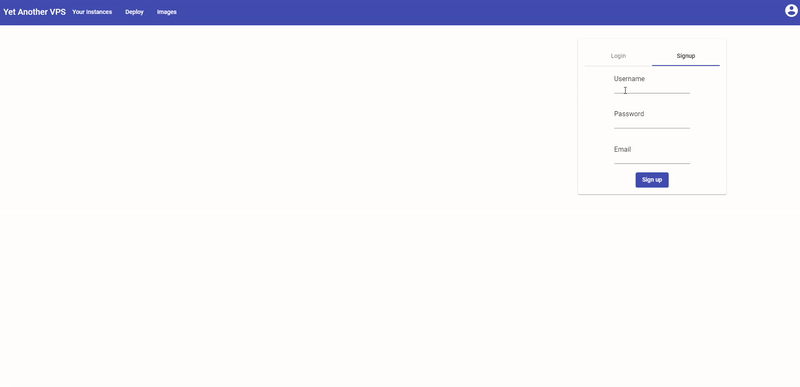
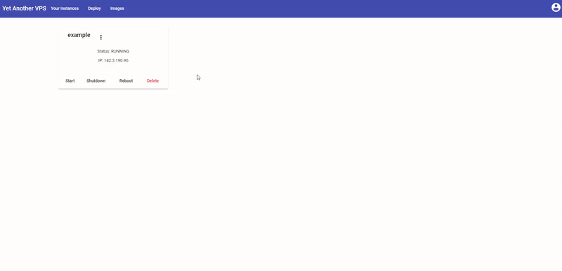

# How To

This document shows how to perform major task.

**Table of Contents:**

- [How To](#how-to)
  - [Signup](#signup)
  - [Create an instance](#create-an-instance)
  - [Create from an image](#create-from-an-image)
  - [Create image](#create-image)
  - [Transfer instance ownership](#transfer-instance-ownership)

## Signup

## Create an instance

## Create from an image

## Create image

## Transfer instance ownership

