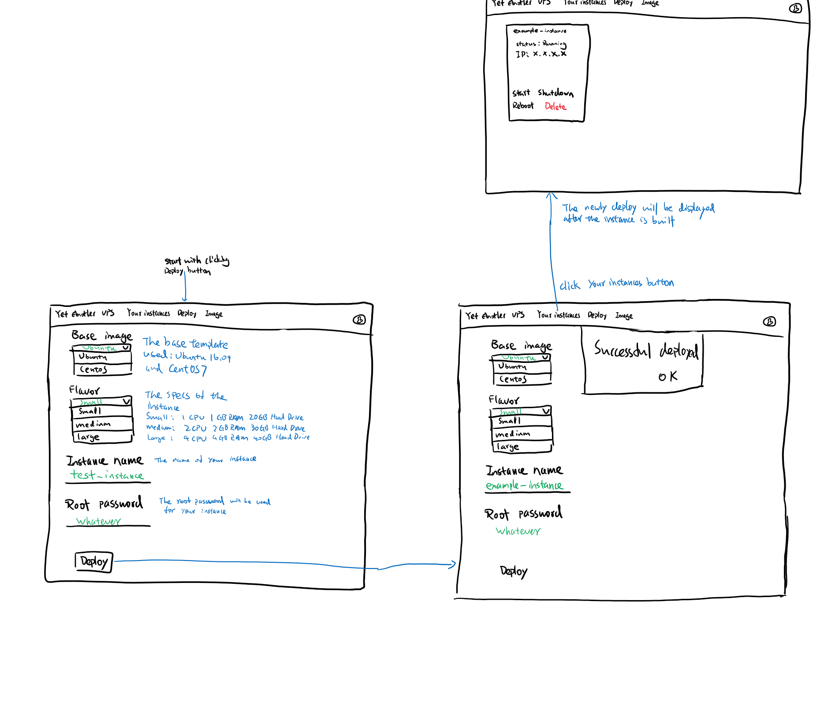
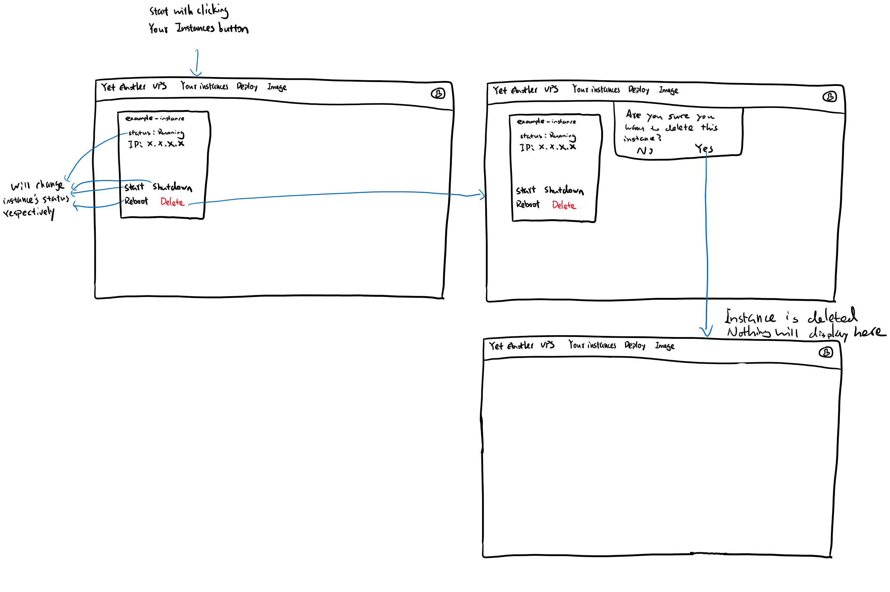
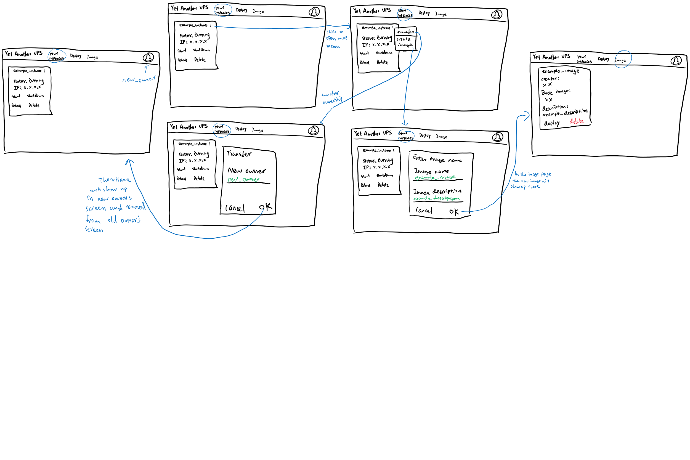
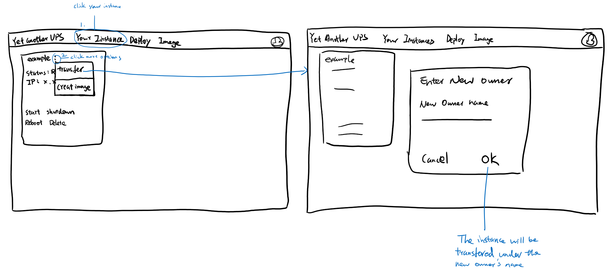

# Lo-Fi Prototypes and Wireframes

This document is to present Lo-Fi prototypes and wireframes of this project

**Table of Contents:**

- [Lo-Fi Prototypes and Wireframes](#lo-fi-prototypes-and-wireframes)
  - [Deploy an Instance](#deploy-an-instance)
  - [Manage Instances](#manage-instances)
  - [Create Image](#create-image)
  - [Transfer Ownership](#transfer-ownership)

## Deploy an Instance

In order to deploy an instance, the user needs to click deploy on the navigation bar, select base image and flavor, enter instance name and root password.

After the instance is successful deployed, it will show up in your instance page by clicking your instance on the navigation bar.

## Manage Instances

The user can manage their instance in your instance page by clicking your instance on the navigation bar. The user has the ability to start, shutdown, reboot and delete their instances.

## Create Image

The user can convert their instances into images (templates that can save other users time and headache for system setup).

In the your instance page, beside the instance name, there is more icon. There is an create image menu item that will open a dialog for entering sufficient information to create the image.

## Transfer Ownership

The user can transfer their virtual machine to another user. This will not change any credentials inside the virtual machine rather a change in the database.

