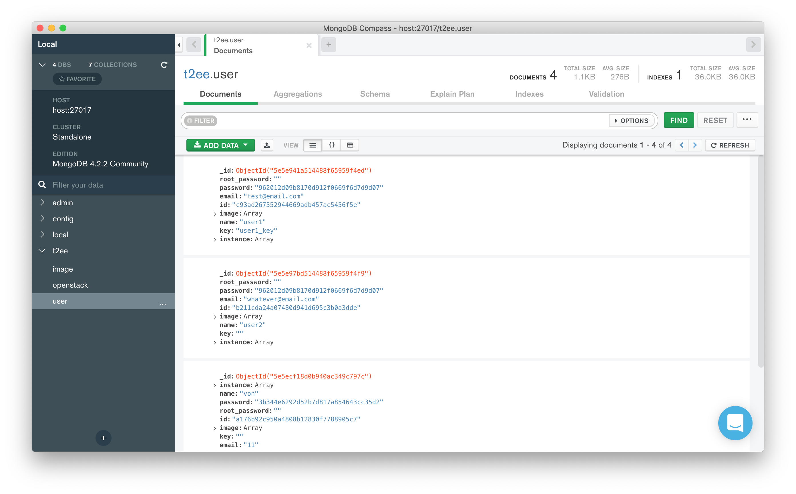
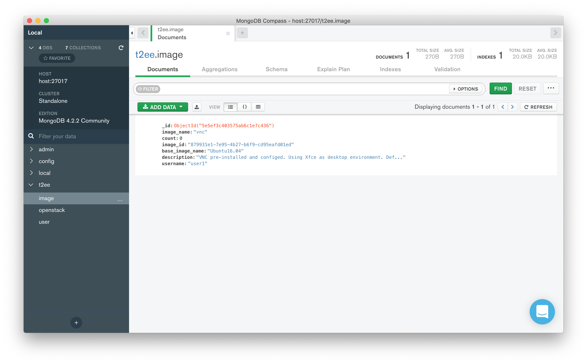

# Role-based access

This document is to explain role-based access for this project.

**Table of Contents:**

- [Role-based access](#role-based-access)
  - [User](#user)
  - [Administrator](#administrator)
    - [OpenStack Horizon](#openstack-horizon)
    - [MongoDB Clients](#mongodb-clients)
      - [User Documents](#user-documents)
      - [Image Documents](#image-documents)

## User

The users will only be using the web interface of this project.

## Administrator

The administrators will be using both the web interface for deploying their own virtual machines or OpenStack Horizon (The OpenStack's Dashboard) and MongoDB client.

### OpenStack Horizon

OpenStack Horizon is the OpenStack's Dashboard that provides a web-based user interface to OpenStack services including Nova, Swift, Keystone, etc. The administrators will be able to manage the instances deployed or rescue an instance runs into troubles.

### MongoDB Clients

The administrators can also use MongoDB clients (MongoDB Compass is used as an example) to manage customized data which is not part of OpenStack stored in the database.

The administrators can connect to the database based on the username, password and port number defined in the [Docker Compose File](../docker-compose.yml)

#### User Documents

The user documents store user data including username, password, email, and instances and images owned. These data are not part of but associate with OpenStack.

#### Image Documents

The image documents store details about images (templates) created by the users. The details include image name, base image name which image is used to create this image, description, and creator.

