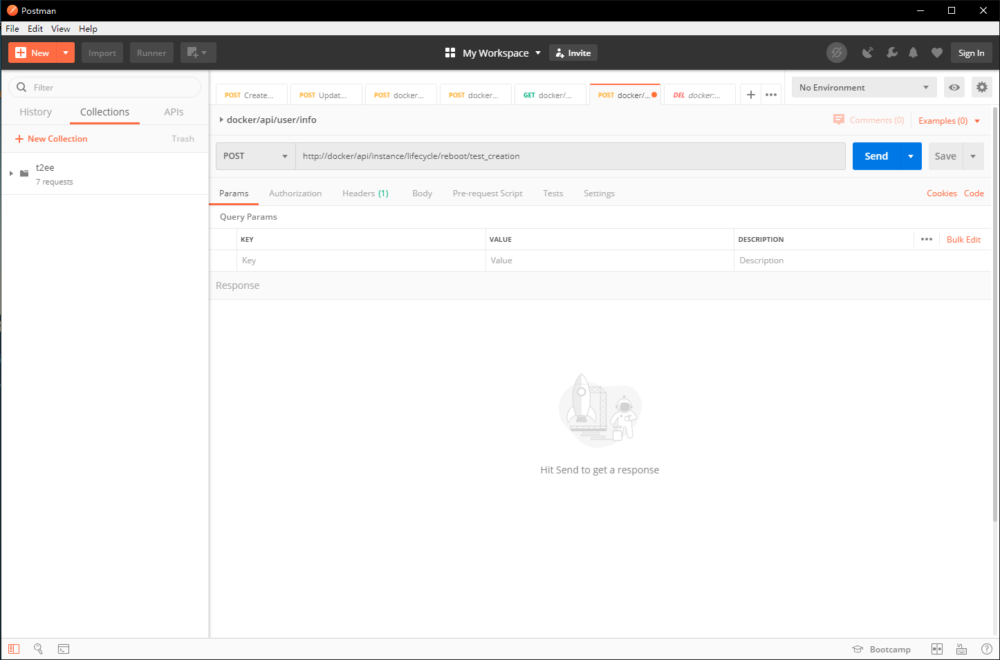

# Test Plan

This document describes the intended test activities.

**Table of Contents:**

- [Test Plan](#test-plan)
  - [Objective](#objective)
  - [Scope](#scope)
  - [Testing Strategy](#testing-strategy)
    - [Unit Testing](#unit-testing)
    - [Functional Testing](#functional-testing)
    - [Black Box Testing](#black-box-testing)
    - [Exploratory Testing](#exploratory-testing)

## Objective

This project is a web-based virtual machine deployment platform used to deploy virtual machines by users themselves. The test plan is to ensure it meets the needs of users and all functionalities work as expected.

## Scope

All requirements will be tested under this plan.

1. The Python library should control OpenStack correctly.
2. The RESTful API should accept defined API calls and response respectively.
3. The front-end should send correct API calls.
4. The front-end should parse and display data properly.

## Testing Strategy

### Unit Testing

The Python library will be tested by unit testing. The unit test cases are located in [Unit Tests](../api/test). The **unittest** framework is used to create test cases.

### Functional Testing

After the Python source code is tested, the functional testing will be used to test the RESTful API.

The functional test will be conducted by using the Postman which is a platform for API development.

It will be used to test every API used in this project defined [here](api.md).

With pre-defined headers, parameters and urls, I can check if I get the expected output.

### Black Box Testing

Then the black box testing will be used to test if the front-end interface sends correct API calls and display the response data properly.

### Exploratory Testing

Finally the exploratory testing will be used to explore the application, look for things that might be wrong or behavior that is unexpected.
